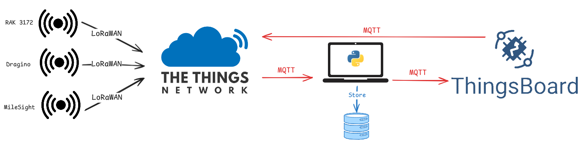

# RIS_Heri-Sure
En este repositorio se podrá encontrar todo el código para la creación del siguiente sistema:

El código estará distribuido en tres carpetas, cada una tendrá el código pertinente.

## RAK 3172
En esta carpeta se encuentra todo lo relacionado con el sensor desarrollado utilizando Arduino IDE.

## Ordenador local
En esta carpeta se encuentra todo lo relacionado con el backend o MQTT wrapper desarrolaldo utilizando python. Tambien se encuentra el fichero SQL para crear la base de datos y los stored procedures que usa el backend. Finalmente, se encuentra el Dockerfile para la creación del contenedor de ThingsBoard.

## ThingsBoard
En esta carpeta se encuentran tanto los flujos enteros del dashboard si se quisiese replicar. Al igual que las cadenas de reglas con las funcionalidades en detalle en otros ficheros.